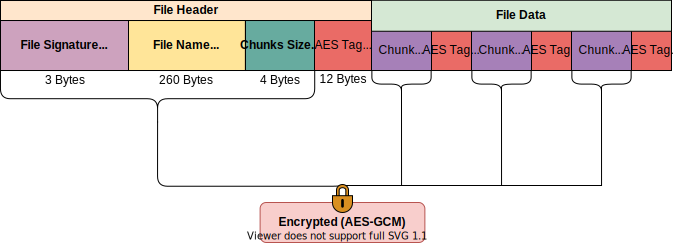
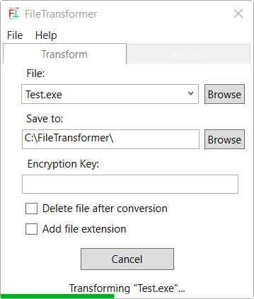

  

# FileTransformer
A tool for converting files to and from an encrypted Base64 text-based files.  
Latest version: [2.0.0](https://github.com/MichaelYochpaz/FileTransformer/releases/latest) ([changelog](https://github.com/MichaelYochpaz/FileTransformer/blob/main/CHANGELOG.md))

## File Header Structure

  

## Features
* Convert any file to and from an encrypted text based (using Base64) file.
* Data is encrypted before Base64 conversion using AES-GCM with an option to choose an encryption key.
* Data integrity is insured as part of the AES-GCM algorithm. Trying to restore a file that was altered will fail.
* Original file's name is embedded within the transformed file, so transformed file's name can be changed without affecting original file.
* An option to automatically delete source file/s after conversion
* An option to check for updates.

##
 
 

  

