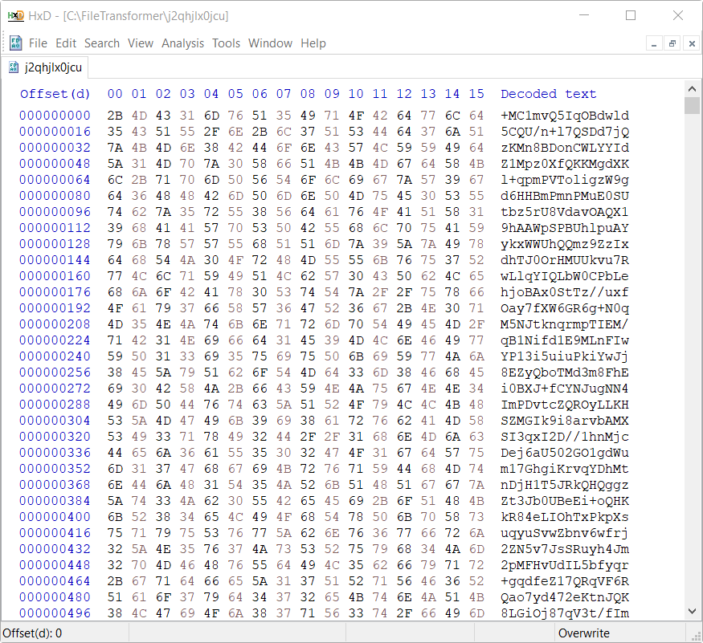

  

# FileTransformer
A tool for converting files to and from encrypted Base64 text-based files.  
Latest version: [2.0.0](https://github.com/MichaelYochpaz/FileTransformer/releases/latest) ([changelog](https://github.com/MichaelYochpaz/FileTransformer/blob/main/CHANGELOG.md))

  
  
  
  

 

## Features
* Convert any file to and from an encrypted text based (using Base64) file.
* Data is encrypted using AES-GCM before Base64 conversion.
* Data integrity is insured as part of the AES-GCM algorithm. Trying to restore a file that was altered will fail.
* Original filename is embedded within the transformed file, so filename of the transformed file can be altered without affecting the original filename.
* An option to automatically delete source files after conversion.
 

## Transformed File Structure

  

 

## Screenshots
 
 

  
   
  
  
   
  

